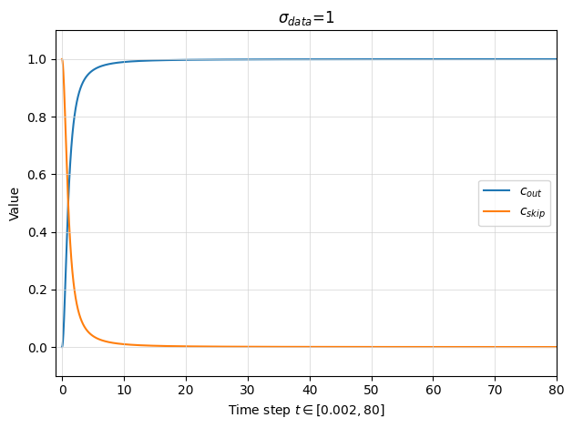

## Is Rectified Flow theoretically better than Diffusion Model? How to "cook" a good diffusion model in practice?

**When considering the task of generating images from Gaussian noise**, the answer is No, meaning that diffusion models could also reach SOTA performance with optimal design choices.

Some Takeaways:
1. The $\epsilon$- or $\bm{x}$-prediction parameterization amplifies the diffusion model prediction error during sampling and is inferior in maintaining model training robustness. In contrast, the velocity prediction in rectified flow provides better training dynamics, making the training more robust thus further reducing the gap between the exact minimum of the mean-squared optimization objective $\mathop{\mathbb{E}}[\bm{x}(1) - \bm{x}(0)\mid\bm{x}(t)]$ and the approximated model prediction $D_{\bm{\theta}}(\bm{x}(t),t)$.
3. To enhance model generation quality with the least inference cost, we should pay much attention to the designs of diffusion model, including the forward SDE, pre-conditioning, training objective (loss weight and noise level sampling), recerse ODE, numerical solver and time steps $\{t_n\}_{n=0}^N$.

#### Background
With the development of diffusion models and rectified flow, there are discussions 

<!-- 

  
<h3>Section 1:  What's the connection between Rectified Flow and Diffusion Model?</h3>
 -->

    
 <h4>Section 1: Basics of DM and RF </h4>

Let's first revisit the mathmatical details of diffusion model and rectified flow. If you are familiar with them, feel free to jump to Section 2. Otherwise, you could also refer to the other blogs that introduces [rectified flow]() and [diffusion models]() in detail.

**Diffusion Model** 

A diffusion model is mathematically defined by the forward process. In SDE, the forward SDE can be written as:

$$
    d\bm{x}=f(\bm{x},t)dt + g(t)d\bm{w},
$$
where $f(\cdot,t): R^{d}\rightarrow R^{d}$ is a vector-valued function known as the **drift** coefficient of $\bm{x}(t)$, $g(t): R\rightarrow R$ is a scalar function known as the **diffusion** coefficient of  $\bm{x}(t)$, and $\bm{w}$ is the standard Wiener process. 
When sampling along the forward process, we could generate a series of samples $\{\bm{x}(t)\}_{t=0}^{T}$ indexed by a continous time variable $t\in[0, T]$, such that $\bm{x}(0) \sim p_0$ and $\bm{x}(T) \sim p_T$. $p_0$ is the target data distribution for which we have i.i.d samples for training our model, while $p_T$ is commonly chosen as a Gaussian distribution $\mathcal{N}(0, \sigma(T)^2\mathbf{I})$.

Given the forward SDE, we have the corresponding reverse SDE that starts from $p_T$ to $p_0$.

$$
     d\bm{x}=(f(\bm{x},t)-g(t)^2\nabla_x\log p_t(\bm{x}))dt + g(t)d\bar{\bm{w}}.
$$
Here, $\bar{\bm{w}}$ is the standard Wiener process when time flow backwards from $T$ to $0$. $dt$ is an infinitesimal negative timestep. $p_t(\bm{x})$ denotes the probability distribution of sample $\bm{x}(t)$ at time step $t$. As a result, given the score function at time step $t$, we can sample along the reverse process and simulate to generate data from $p_0$.

The score of the marginal distribution can be approximated by the following score matching objective:

$$
\theta^* = \argmin_\theta  \mathop{\mathbb{E}}_{t} \bigl\{ \lambda(t)\mathop{\mathbb{E}}_{\bm{x}(0)}\mathop{\mathbb{E}}_{\bm{x}(t)\mid\bm{x}(0)} \big[ || s_{\bm{\theta}}(\bm{x}(t), t) - \nabla_{\bm{x}(t)}\log p_t(\bm{x}(t)\mid\bm{x}(0)) ||^2_2 \bigr] \bigr\}, 
\tag{1}
$$

where $\lambda(t)$ is a weighting funciton, $t$ is uniformly sampled over $[0,T]$, $\bm{x}(0)\sim p_0(\bm{x})$, $\bm{x}(t) \sim p_{0t}(\bm{x}(t)\mid\bm{x}(0))$, which denotes the transition kernel from $0$ to $t$. It has the general form:

$$
p_{0t}(\bm{x}(t)\mid\bm{x}(0)) = \mathcal{N}(\bm{x}(t);s(t)\bm{x}(0), s(t)^2\sigma(t)^2\mathbf{I}),
$$
where 

$$
    s(t) = \exp(\int_0^t{f(\xi)d\xi}), \sigma(t) = \sqrt{\int_0^t{\frac{g(\xi)^2}{s(\xi)^2}}d\xi},
$$
where we assume a linear drift coefficient: $f(\bm{x}, t) = f(t)\bm{x}$.
<!-- The training objective ensures that the optimal solution $\bm{s_\theta^*}(\bm{x}(t), t)$ equals $\nabla_x\log p_t(\bm{x})$ for almost all $\bm{x}$ and $t$. -->

Given the definition of the transition kernel, the score of the conditional distribution can be decomposed as: 

$$
    \nabla_{\bm{x}(t)}\log p_t(\bm{x}(t)\mid\bm{x}(0)) = \frac{\bm{x}(t)-s(t)\bm{x}(0)}{s(t)^2\sigma(t)^2}.
$$
In practice, we typically parameterize the score model $s_{\bm{\theta}}(\bm{x}(t), t)$ as $\epsilon$-prediction or $x$-prediction. Namely:
$s_{\bm{\theta}}(\bm{x}(t), t) = -\frac{D_{\bm{\theta}}(\bm{x}(t),t)}{s(t)\sigma(t)}$ or $s_{\bm{\theta}}(\bm{x}(t), t) = -\frac{\bm{x}(t)-s(t)D_{\bm{\theta}}(\bm{x}(t),t)}{s(t)^2\sigma(t)^2}$.

For brevity, we consider the diffusion model defined in EDM, where $f(\bm{x}, t)=0$ and $g(t)=\sqrt{2t}$, $t\in[T_{min}, T_{max}]$, $T_{min}=0.002$ and $T_{max}=80$. As a result, we have $s(t)=1$ and $\sigma(t)=t$. The $\epsilon$-prediction and $x$-prediction parameterization can be written as: $s_{\bm{\theta}}(\bm{x}(t), t) = -\frac{D_{\bm{\theta}}(\bm{x}(t),t)}{t}$ and $s_{\bm{\theta}}(\bm{x}(t), t) = -\frac{\bm{x}(t)-D_{\bm{\theta}}(\bm{x}(t),t)}{t^2}$ respectively.

**Rectified FLow**

Rather than starting from SDE training to ODE sampling as in diffusion models, the rectified flow proposes approximating a forward ODE with a velocity model $v_{\bm{\theta}}$. The forward ODE is defined as

$$
    \frac{d\bm{x}(t)}{dt} = \bm{x}(1) - \bm{x}(0),
$$
where $t\in[0,1]$, $\bm{x}(1)\sim\mathcal{N}(0,\mathbf{I})$, $\bm{x}(0)\sim p_0$. The above ODE moves sample $\bm{x}(0)$ from $p_0$ to $\bm{x}(1)$ in $\mathcal{N}(0,\mathbf{I})$. To transport backwards from $\mathcal{N}(0,\mathbf{I})$ to $p_0$, it proposes to approximate an ODE that yields the same marginal distribution of $\bm{x}(t)$ as the above equation. The training objective is

$$
    \argmin_{\theta}\int_0^1\mathop{\mathbb{E}}\bigl[||(\bm{x}(1)-\bm{x}(0)) - v_{\bm{\theta}}(\bm{x}(t), t)  ||^2_2\bigr]dt, \quad\text{with}\quad\bm{x}(t) = t\bm{x}(1) - (1-t)\bm{x}(0). \tag{2}
$$

    
 <h4> Section 2: What's the difference between DM and RF? </h4>

When parameterizing the score model with the $\bm{\epsilon}$- or $x$-prediction, DMs are dictated to predict the noise $\bm{\epsilon}$ or $\bm{x}(0)$ at time step $t$. Considering that these two parameterizations only result in different optimization weight coefficient, without loss of generality, let's focus on the weakness of the $\bm{\epsilon}$-prediction formulation. With the $\bm{\epsilon}$-prediction model parameterization, the signal is reconstructed via $\hat{\bm{x}}(0)=\bm{x}(t) - t\cdot D_{\bm{\theta}}(\bm{x}(t),t)$. This leads to the model prediction eror being magnified by a factor of $t$, which introduces excessive error during early sampling process and results in poor sample generation quality in particular when the total discretization steps is small.

In contrast, RFs train $D_{\bm{\theta}}(\bm{x}(t), t)$, $t\in[0,1]$, to predict the velocity $\bm{x}(1)-\bm{x}(0)$. During sampling, we traverse backwards in time step-by-step via:

$$
    \bm{x}(t_{n-1}) = \bm{x}(t_n) - t\cdot D_{\bm{\theta}}(\bm{x}(t_n), t_n),\quad\text{with}\ n\in[0,N]
$$

Although the model prediction is also multiplied by a coefficient $t$, the prediction error remains constrained. This is because $t$ ranges in $[0,1]$ in RFs. In addition, the RFs' training velocity objective also provides a practically better training dynamics by making the training more robust, reducing unexpected prediction error made by $D_{\bm{\theta}}$. To demonstrate this, we decompose the training objective in Equation 2 at time $t$ into a irreducible constant error and approximation error:

$$
   \mathop{\mathbb{E}}\bigl[\underbrace{||(\bm{x}(1) - \bm{x}(0)) - \mathop{\mathbb{E}}[\bm{x}(1) - \bm{x}(0) \mid \bm{x}(t)] ||^2_2}_{\text{irreducible constant error}} + \underbrace{||v_{\bm{\theta}}(\bm{x}(t), t) - \mathop{\mathbb{E}}[\bm{x}(1) - \bm{x}(0) \mid \bm{x}(t)]||^2_2}_{\text{approximation error}} \bigr].
$$
The irreducible constant error is the lower bound of the optimization objective at time $t$ while the approximation error determines how good the model performs. An optimal training dynamics largely benefits model convergence and pushes the approximation error to near zero. The analysis on the decomposed training objective is also applicable to diffusion models, where the optimal solution for Equation 1 is $\mathop{\mathbb{E}}[\bm{x}(0) \mid\bm{x}(t)]$ .

For diffusion model, to mitigate model prediction error during training and bring it under control during sampling, it's more reasonable to predict the expected signal $\hat{\bm{x}}(0)$ directly at large $t$.
As a result, EDM proposes to predict a mixture of noise and clean image at different $t$.
Specifically, it parameterizes

$$
s_{\bm{\theta}}(\bm{x}(t), t) = -\frac{\bm{x}(t)-[c_{out}(t)*D_{\bm{\theta}}(\bm{x}(t),t) + c_{skip}\bm{x}(t)]}{t^2},
$$
where $c_{out}(t)$ and $c_{skip}(t)$ is the scalar function. The training objective becomes:

$$
    \argmin_\theta \mathop{\mathbb{E}}\bigl[c_{out}(t)^2\cdot ||D_{\bm{\theta}}(\bm{x}(t),t) - \frac{1}{c_{out}}(\bm{x}_0 - c_{skip}\bm{x}(t) ) ||^{2}_{2} \bigr]
$$

As demonstrated in Figure 1, for $c_{out}(t)$ and $c_{skip}(t)$ are chosen such that the variance of effective target equals to 1: $Var[\frac{1}{c_{out}}(\bm{x}_0 - c_{skip}\bm{x}(t)]=1$. Besides, when $t=T_{max}$, $c_{skip}(t)=0$, $D_{\bm{\theta}}$ predicts signal $\bm{x}(0)$; when $t=T_{min}$, $c_{out}(t)=0$, $D_{\bm{\theta}}$ predicts $\bm{\epsilon}$. The above design ensures the model prediction error is amplified as little as possible across all time steps. By adopting the parameterization and preconditioning, the training is more stable and robust, as evidenced by the experiments in EDM (Table 2 in EDM).

 

#### Section 3: How to train a diffusion model?

Given the above analysis, the sampler, curvature of sampling trajectory and model prediction error play a key role in the generation peformance. These are initially affected by the design of forward SDE. In EDM, the authors argue that

In a nutshell, the vanilla DMs (e.g. DDPM and SDE) perform sub-optimally, in particular when using less sampling steps, due to sub-optimal designs, including:

- **Choice of the diffuison forward process**, which defines the PF-ODE sampling trajectory. A less curved sampling trajectory naturally supports larger discretization time step size. However, even when approximating the score with a sub-optimally designed SDE, we could generate samples by utilizing a different yet largely improved ODE, such as setting $s(t)=1$ and $\sigma(t)=t$.
- **Preconditioning**, which dictates training dynamics and the model prediction errors. A better training objective lowers model prediction errors and make the training more robust.
- **Loss weight and Noise level sampling** balance and stress training efforts at different time step.
- **SDE/ODE solver and time discretization schedule**. The numerical solver introduces truncation error related to the curvature of the sampling trajectory and the time discretization schedule determines how the truncation error are distributed among different noise levels. The step size should decrease monotonically with decreasing $\sigma(t)$.

<!-- 

    
<h4> Section 3: Remaining questions (Updating) </h4> 
 -->

####  Remaining questions (Updating) 
There're several questions that remain to be further explored. I'll answer them on-by-one once experiments are finished. 

- In the context of RF, what's the relationship between the curvature of the sampling trajectory and the "straightness" and speed uniformity of the forward ODE? A theoretical analysis

> Paper for reference: 
> - Minimizing Trajectory Curvature of ODE-based Generative Models: study the relationship between sampling curvature and forward process. It proposes that the curvature is determined by the coupling degree between noise $\epsilon$ and clean data $\bm{x}$ or, more simply, the way we sample the training data pair ($\epsilon$, $\bm{x}$). This is similar rationale of the immiscible diffusion paper which "pairs" $\bm{x}$ with the noise $\epsilon$ that is closest to $\bm{x}$ in Euclidean distance.
> - Accelerating Diffusion Training with Noise Assignment

- In the context of DMs, if we train DM (VP-SDE) by adopting the F-prediction in EDM and sample via the $\epsilon$-prediction (thus the sampling amplifies the model prediction error), would this improve the model generation performance in comparison with the counterpart trained with $\epsilon$-prediction (also sample with $\epsilon$-prediction)? Moreover, would sampling with v-prediction improve the model generation performance even when parameterized with $\epsilon$-prediction ?

- Can we transform RFs to DMs and vice versa? A theoretical analysis

### Other interesting topics
1. Connections between Loss weighting and time sampling schedule？
Takeaways:
- Setting loss weight w.r.t $\sigma(t)$ is equivalent to setting a time sampling schedule from the perspective of optimization.
- As suggested in EDM, it's more preferrable to decouple the role of loss weight and time sampling schedule. The loss weight balances effective loss values across time steps and time sampling schedule to stress training efforts within relevant time range.

*Question: what about EDM2 and the adaptive loss weighting used in ECT (pseudo-huber loss)*

2. EDM Done Right. Takeaways:
- Diffusion models trained with any framework can adopt any ODE samplers, even those that are different from the one defined by the forward SDE used during training.
- Time discretization schedule matters: allocate less at large t and more at small t.
- Design of the SDE matters: set $s(t)=1$ and $\sigma(t)=t$ benefit sampling.
- Model parameterization matters: predict mixture of $\bm{x}(0)$ and $\bm{\epsilon}$.
- Loss weights/Time step sampling schedule matters

3. Tweedie's formula and its relation to the score $\nabla_x\log p_t(\bm{x})$

Given the denoising score matching training objective:

$$
\theta^* = \argmin_{\theta}  \mathbb{E}_{t} \bigl\{ \lambda(t)\mathop{\mathbb{E}}_{\bm{x}(0)}\mathop{\mathbb{E}}_{\bm{x}(t)\mid\bm{x}(0)} \big[ || s_{\bm{\theta}}(\bm{x}(t), t) - \nabla_{\bm{x}(t)}\log p_t(\bm{x}(t)\mid\bm{x}(0)) ||^2_2 \bigr] \bigr\},
$$

Then, we derive the exact minimum of the above equation at time $t$. Decompose the norm, we have:
$$

$$

### Reference
[1] DDPM  
[2] SDE  
[3] EDM  
[4] Rectified Flow  
[5] 

<!-- 
 -->

<!-- 
 -->

<!-- 

  
<h3>Section2: Connections between Loss weighting and time sampling schedule</h3>

 -->